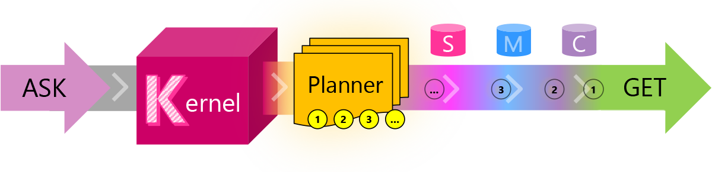

# Semantic Kernel

Semantic Kernel (SK) is a lightweight SDK that lets you easily mix conventional programming languages with the latest in Large Language Model (LLM) AI "prompts" with templating, chaining, and planning capabilities out-of-the-box.

### Components

| Journey       |	Short Description                                                               |
|---------------|-----------------------------------------------------------------------------------|
| ASK           |	A user's goal                                                                   |
| Kernel        |	Orchestrator                                                                    |
| Planner       |	Planner breaks ASK down into steps based upon available resources            | 
| Resources     |	Available skills, memories, and connectors         |
| Steps         |	Series of steps for the kernel to execute                           |
| Pipeline      |	Executing the steps results in fulfilling the user's ASK                        |
| GET           |	And the user gets what they asked for ...                                       |

What is an example of an ASK and each of the other components?

#### Prompt Templating

#### Function Chaining

#### Vectorized Memory

#### Intelligent Planning

#### Schillace Laws of Semantic AI

https://learn.microsoft.com/en-us/semantic-kernel/howto/schillacelaws

https://learn.microsoft.com/en-us/semantic-kernel/

Samples
https://github.com/microsoft/semantic-kernel/tree/main/samples

Large Language Model AI

    Overview
    Models
    Prompts
    Tokens
    Embeddings

Semantic Kernel Concepts

    Overview
    Kernel
    Planner
    Skills
    Connectors

Building Skills

    Overview
    Semantic Functions
    Native Functions
    Core Skills
